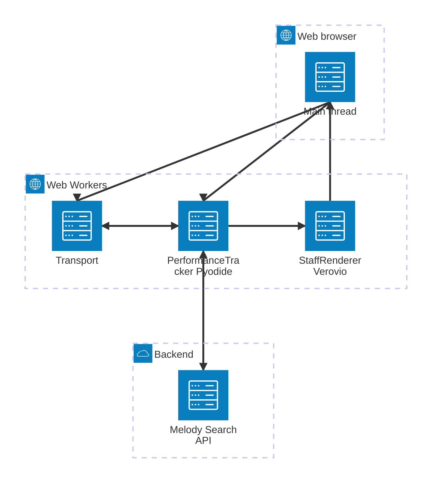

Architecture diagram
--------------------

```mermaid
architecture-beta
    group main(internet)[Web browser]
    service mainthread(server)[Main thread] in main

    group workers(internet)[Web Workers]
    service worker1(server)[Transport] in workers
    service worker2(server)[PerformanceTracker Pyodide] in workers
    service worker3(server)[StaffRenderer Verovio] in workers

    group backend(cloud)[Backend]
    service api(server)[Melody Search API] in backend

    mainthread:B <--> T:worker1
    mainthread:B <--> T:worker2

    worker1:R <--> L:worker2
    worker2:R --> L:worker3
    worker2:B <--> T:api
    worker3:T --> B:mainthread
```
